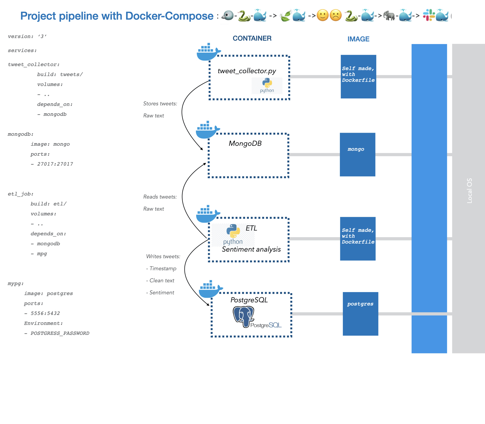
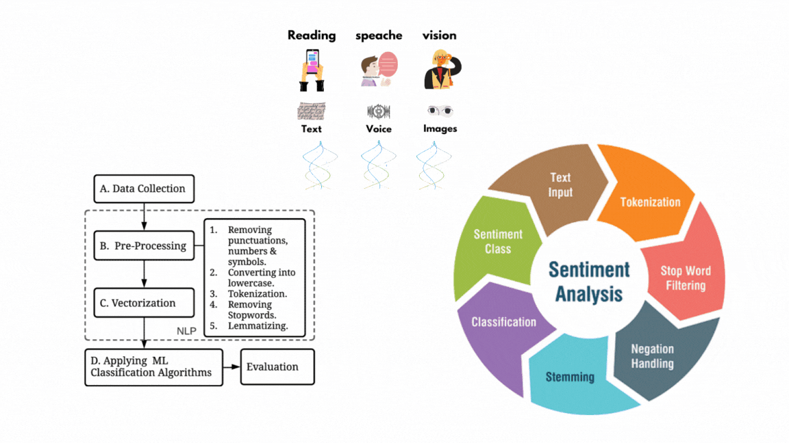

# Social Media Sentiment Analysis Project
This project collects customer social media posts using Twitter API, cleans the data by removing irrelevant information and converting it into the appropriate format, organizes data in databases by using PostgreSQL and MongoDB, and uses natural language processing (NLP) and machine learning (ML) to classify texts as positive, negative or neutral.

## Data Pipeline
The data pipeline includes the following five steps:

**1. Extract tweets with Tweepy API**: Tweets are extracted from Twitter using Tweepy API.

**2. Load tweets in MongoDB**: Extracted tweets are stored in a MongoDB.

**3. Perform sentiment analysis and load data in a PostgresDB**: Tweets are extracted from MongoDB, sentiment analysis is performed on the tweets, and the transformed data is loaded into a PostgresDB using an ETL job.

**4 Load tweets and corresponding sentiment assessment in a PostgresDB**: The tweets and their corresponding sentiment assessment are loaded into a PostgresDB.

**5. Post data in a Slack channel with a Slack bot**: The data is extracted from the PostgresDB and posted in a Slack channel using a Slack bot.

The `sentiment analysis` is performed using Natural Language Processing (NLP) and Machine Learning (ML) techniques to classify texts as `positive, negative, or neutral`. We use the `VADER lexicon`, which is a lexicon and rule-based sentiment analysis tool. This approach takes into account polarity `(positive/negative) and intensity`.

##  Technology Stack
The project uses the following technology stack:

* Tweepy API for extracting tweets from Twitter.
* MongoDB for storing the extracted tweets.
* PostgreSQL for storing the transformed data.
* Natural Language Processing (NLP) and Machine Learning (ML) for sentiment analysis.\
* VADER lexicon rule-based sentiment analysis tool.
* Slack API for posting data in a Slack channel.

## Setup
To run the project, follow these steps:
1. Clone the repository: git clone https://github.com/nurinero/Social_media_Sentiment_Analysis.git
2. Install the required packages: pip install -r requirements.txt
3. Setup the credentials for Tweepy API, MongoDB, PostgresDB, and Slack API.
4. Run the project inside the docker contetner.

## Conclusion
This project shows how to collect customer social media posts using Twitter API, perform sentiment analysis on the tweets using NLP and ML, and store the data in databases. It also demonstrates how to post the data in a Slack channel using a Slack bot.
## License
This project is licensed under the MIT License - see the LICENSE file for details.
